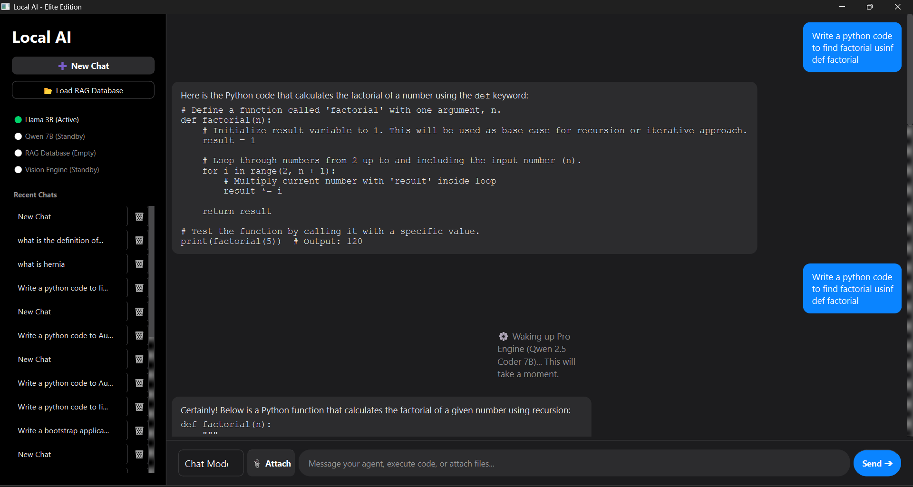

# Local AI - Elite Edition 🚀

Local AI - Elite Edition is a 100% offline, privacy-first desktop artificial intelligence application built with **Python**, **PySide6 (Qt)**, and **GPT4All**. It brings multi-modal capabilities—including standard chatting, advanced code generation, document-based Retrieval-Augmented Generation (RAG), and image vision—straight to your local machine's CPU. No API keys, no subscriptions, and zero data leaving your device.



## ✨ Key Features

- **Dynamic Dual-Brain Architecture:**
  - **Chat Mode (Llama 3.2 3B):** Lightweight, blazing-fast response engine optimized for everyday tasks, text manipulation, and rapid assistance.
  - **Pro Mode (Qwen 2.5 Coder 7B):** Heavy-duty, lazy-loaded engineering core optimized for multi-class scripting, strict software architecture design, and granular code debugging.
- **Advanced RAG Engine:** Upload `.txt`, `.pdf`, or `.docx` files to automatically generate a local context vector database powered by Meta's **FAISS**, enabling sub-second contextual querying of huge materials.
- **Visual Intelligence:** Dynamic local visual analysis powered by the **Moondream2** vision model.
- **Rich User Experience:** Features a fully asynchronous, multi-threaded `QThread` processing layer that prevents UI freezing, an elegant native dark-mode stylesheet, local markdown visualization, and automated chat session logging.

## 🛠️ Tech Stack

- **GUI Framework:** PySide6 (Qt for Python)
- **Inference Backends:** GPT4All, HuggingFace Transformers, PyTorch
- **Vector Indexing:** FAISS (Facebook AI Similarity Search)
- **Web Scraping Components:** DuckDuckGo Search API (`duckduckgo_search`)

---

## 🚀 Getting Started

### 1. Prerequisites
Ensure you have Python 3.10 or newer installed on your machine.

### 2. Clone the Repository
```bash
git clone [https://github.com/swagatambordoloi/Local-Ai.git](https://github.com/swagatambordoloi/Local-Ai.git)
cd Local-Ai
```
3. Install Dependencies
It is highly recommended to use a virtual environment:
# Create environment
python -m venv venv

# Activate environment (Windows)
venv\Scripts\activate

# Activate environment (macOS/Linux)
source venv/bin/activate

# Install required packages
pip install -r requirements.txt

4. Setup Local Model Binaries
For the application to boot correctly, download your model files and place them inside the root directory alongside your main script:

Llama 3.2 3B Instruct: Download Llama-3.2-3B-Instruct-Q4_K_M.gguf from the GPT4All model repository.

Qwen 2.5 Coder 7B: Download Qwen2.5-Coder-7B-Instruct-Q4_K_M.gguf from HuggingFace.

Your final folder execution path should look exactly like this:
Local-Ai/
├── On_device_ai.py
├── requirements.txt
├── README.md
├── Llama-3.2-3B-Instruct-Q4_K_M.gguf
└── Qwen2.5-Coder-7B-Instruct-Q4_K_M.gguf

💻 Usage
Launch the desktop app directly from your terminal or IDE:
python On_device_ai.py

Tips for Optimal Performance:
First-Time Pro Mode / Vision Use: There will be a brief initialization delay while the massive model weights load directly into system memory. The responsive "Thinking" animation will trace this deployment.

RAG Uploads: Once document files are indexed, they persist purely for the active chat session context.

🔒 Privacy & Architecture Guardrails
Zero Data Leakage: This application does not implement metrics, tracking tags, or remote analytical collection.

Thread Isolation: The graphical window layer handles user events on the master thread while spinning up runtime tasks inside parallel background workers to ensure predictable interface responsiveness.
